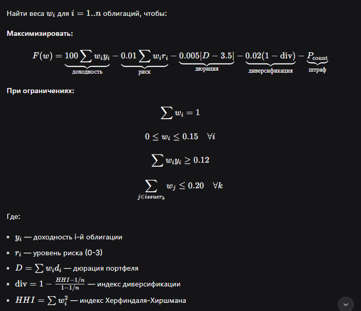

┌─────────────────────────────────────────────────────────────────────┐
│                      BondsPortfolioAnalysisPipeline                 │
│                         (Основной конвейер)                          │
├─────────────────────────────────────────────────────────────────────┤
│ 1. BondsDataLoader     → Загрузка данных из Excel                   │
│ 2. BondsAnalyzer       → Расчет метрик по каждой облигации          │
│ 3. BondScorer          → Скоринг и ранжирование облигаций           │
│ 4. BondsPortfolioOptimizer → Оптимизация портфеля                   │
│ 5. BondsPortfolioVisualizer → Визуализация результатов              │
│ 6. BondsExcelReportGenerator → Генерация Excel отчета               │
└─────────────────────────────────────────────────────────────────────┘

📥 1. BondsDataLoader — загрузка данных
Что делает:

Читает Excel-файл с данными об облигациях

Приводит данные к единому формату

Фильтрует только будущие даты погашения

Логика:

python
df = pd.read_excel(file_path)
# Переименовывает колонки в понятные названия
df.columns = ["ticker", "name", "sector", "currency", "maturity_date", ...]

# Заполняет пропуски значениями по умолчанию
df["sector"] = df["sector"].fillna("other")
df["currency"] = df["currency"].fillna("rub")

# Оставляет только облигации с будущей датой погашения
df = df[df["maturity_date"] > today]
Почему так: Облигации с прошедшей датой погашения уже не торгуются.

📐 2. Bond — структура данных облигации
Каждая облигация представлена как dataclass с множеством полей:

python
@dataclass
class Bond:
    ticker: str                # Уникальный идентификатор
    name: str                   # Название эмитента
    sector: str                 # Сектор экономики
    currency: str               # Валюта (RUB, CNY, USD, EUR)
    maturity_date: date         # Дата погашения
    nominal: float               # Номинал
    risk_level: int              # Уровень риска (0-3)
    floating_coupon: bool        # Плавающий купон?
    coupon_rate: float            # Ставка купона (%)

Расчетные параметры (метод calculate_metrics)
Параметр	Формула	Смысл
years_to_maturity	days/365	Лет до погашения
current_yield	coupon_rate/100	Текущая доходность
yield_to_maturity	Для флоатеров: base_rate + spread	Доходность к погашению
modified_duration	years/(1+yield)	Чувствительность цены к ставке
convexity	years²/100	Кривизна кривой цена-доходность
credit_spread	ytm - risk_free_rate	Премия за риск
liquidity_score	min(nominal/1000,1)*(1-risk*0.2)	Оценка ликвидности
real_yield	current_yield - inflation	Реальная доходность

📊 3. BondsAnalyzer — анализ облигаций
3.1 Статистика по уровням риска
Группирует облигации по risk_level (0,1,2,3) и считает:

Среднюю, мин, макс доходность

Среднюю дюрацию

Количество облигаций

Результат:

text
risk_level  Avg Yield  Min Yield  Max Yield  Count
0              13.06       0.01      25.00     60
1              13.39       0.00      25.25    660
2              16.28       0.00      29.50    381
3              20.83       0.00      33.00    375
Вывод: Риск-уровень 3 дает максимальную доходность (21%), но и максимальный разброс.

3.2 Статистика по валютам
Группировка по валютам:

text
currency  Avg Yield  Count  Total Nominal
cny           7.01     22       20200
rub          16.25   1440    55131018
usd           5.87     13       13000
Вывод: Рублевые облигации — основной рынок (1440 шт.), доходность 16.25%.

 4. BondScorer — скоринг облигаций
Это ключевой механизм отбора лучших облигаций. Каждая облигация получает оценку по 6 критериям.

Веса критериев (из констант):
python
SCORING_WEIGHTS = {
    'yield_score': 0.30,     # Доходность (30%)
    'risk_score': 0.25,      # Риск (25%)
    'liquidity_score': 0.15, # Ликвидность (15%)
    'duration_score': 0.10,  # Дюрация (10%)
    'sector_score': 0.10,    # Сектор (10%)
    'currency_score': 0.10   # Валюта (10%)
}
Как считаются скоринговые баллы:
1. Yield Score (чем выше доходность, тем лучше)
python
# Нормализация доходности относительно всех облигаций
bond.yield_score = (bond.current_yield - min_yield) / (max_yield - min_yield)
2. Risk Score (чем ниже риск, тем лучше)
python
bond.risk_score = 1 - (bond.risk_level / 3)  # risk_level 0 → 1.0, risk_level 3 → 0.0
3. Liquidity Score (чем выше номинал и ниже риск, тем ликвиднее)
python
bond.liquidity_score_norm = min(nominal/1000, 1) * (1 - risk_level * 0.2)
4. Duration Score (чем ближе к целевой дюрации, тем лучше)
python
target_dur = OPTIMIZATION_PARAMS["target_duration"]  # 3.5 года
deviation = abs(bond.modified_duration - target_dur)
bond.duration_score = 1 - min(deviation / target_dur, 1)
5. Sector Score (приоритетные сектора получают выше балл)
python
sector_weight = SECTORS.get(bond.sector, {}).get("max_weight", 0.1)
bond.sector_score = min(sector_weight * 5, 1)  # max_weight 0.2 → score 1.0
6. Currency Score (минимальная доходность по валюте)
python
min_yield = CURRENCY_PARAMS[bond.currency]["min_yield"]
if bond.current_yield >= min_yield:
    bond.currency_score = 1
else:
    bond.currency_score = bond.current_yield / min_yield
Итоговый score:
python
bond.total_score = sum(weight * score for weight, score in zip(weights, scores))
После скоринга берем топ-50 облигаций для оптимизации.

📈 5. BondsPortfolioOptimizer — оптимизация портфеля
5.1 Статистика портфеля
python
def portfolio_statistics(self, weights):
    portfolio_yield = sum(weight * bond.current_yield)
    portfolio_duration = sum(weight * bond.modified_duration)
    portfolio_risk = sum(weight * bond.risk_level)
    
    # Индекс концентрации Херфиндаля-Хиршмана
    hhi = sum(weight²)
    
    # Оценка диверсификации (1 = идеально диверсифицирован)
    diversification = 1 - (hhi - 1/n) / (1 - 1/n)
5.2 Целевая функция (что оптимизируем)
python
def objective_function(self, weights):
    stats = self.portfolio_statistics(weights)
    
    # Максимизируем доходность
    yield_score = stats["yield"] * 100
    
    # Минимизируем риск
    risk_penalty = stats["risk_score"] * 0.01
    
    # Штраф за отклонение от целевой дюрации
    duration_penalty = abs(stats["duration"] - 3.5) * 0.005
    
    # Штраф за плохую диверсификацию
    div_penalty = (1 - stats["diversification"]) * 0.02
    
    # Штраф за слишком мало/много облигаций
    n_bonds_penalty = max(0, stats["n_bonds"] - 30) * 0.005
    n_bonds_penalty += max(0, 15 - stats["n_bonds"]) * 0.01
    
    return -(yield_score - risk_penalty - duration_penalty - div_penalty - n_bonds_penalty)
Что мы минимизируем (на самом деле максимизируем отрицание):

text
Score = Доходность×100 
        - Риск×0.01 
        - |Дюрация - 3.5|×0.005 
        - (1 - Диверсификация)×0.02 
        - Штраф за количество
5.3 Ограничения (constraints)
python
def check_constraints(self, weights):
    # Минимальная доходность не ниже 12%
    if stats["yield"] < 0.12: return False
    
    # Ни одна облигация не больше 15%
    if max(weights) > 0.15: return False
    
    # Ни один эмитент не больше 20%
    issuer_weights = группировка по первому слову названия
    if max(issuer_weights.values()) > 0.20: return False
    
    return True
5.4 Метод оптимизации — дифференциальная эволюция
Почему именно differential_evolution, а не простой minimize?

Метод	Плюсы	Минусы
SLSQP (градиентный)	Быстрый	Находит локальный минимум
Differential Evolution	Находит глобальный минимум	Медленнее
Как работает дифференциальная эволюция:

text
1. Создаем популяцию случайных портфелей (popsize=15)
2. Для каждого портфеля:
   - Выбираем 3 случайных портфеля
   - Создаем "мутанта" = портфель1 + F*(портфель2 - портфель3)
   - Скрещиваем мутанта с текущим портфелем
   - Если потомок лучше — заменяем
3. Повторяем maxiter=1000 раз
4. Сходимся к глобальному оптимуму
Параметры:

popsize=15 — размер популяции

maxiter=1000 — максимум итераций

tol=1e-6 — точность

seed=42 — воспроизводимость

🎨 6. BondsPortfolioVisualizer — визуализация
6.1 Кривая доходности (Yield Curve)
Точечный график: доходность vs лет до погашения. Разные цвета — уровни риска.

Красная линия — безрисковая ставка (16%)

Позволяет увидеть, какие облигации дают аномально высокую доходность

6.2 Секторальное распределение
Круговая диаграмма — какой сектор сколько весит в портфеле.

6.3 Валютное распределение
Круговая диаграмма — RUB, CNY, USD, EUR.

6.4 Профиль погашений (Maturity Profile)
Столбчатая диаграмма — вес каждой облигации и срок до погашения.

6.5 Анализ рисков (Risk Analysis)
Две диаграммы:

Столбцы: доходность, дюрация, диверсификация, риск

Круговая: распределение риска по источникам (доходность, дюрация, концентрация, кредит)

📑 7. BondsExcelReportGenerator — Excel отчет
Создает Excel-файл с 7 листами:

Portfolio Summary — сводка по портфелю

Portfolio Holdings — детальный состав

Risk Statistics — статистика по уровням риска

Currency Statistics — статистика по валютам

All Bonds — полный список со скоринговыми оценками

Risk Portfolios — портфели для разных уровней риска

Optimization Params — параметры оптимизации

🔄 8. BondsPortfolioAnalysisPipeline — основной конвейер
Объединяет все шаги в единый процесс:

python
def run(self, file_path):
    1. Загрузить данные
    2. Рассчитать метрики
    3. Вывести статистику
    4. Отобрать топ-50 по скорингу
    5. Построить кривую доходности
    6. Оптимизировать портфель
    7. Сформировать портфели по уровням риска
    8. Визуализировать
    9. Сохранить Excel
🧠 Математическая модель оптимизации
Постановка задачи:
​
  — индекс Херфиндаля-Хиршмана

💡 Ключевые выводы из кода
Скоринг — позволяет объективно сравнивать облигации по множеству критериев

Дифференциальная эволюция — находит глобальный оптимум в сложном пространстве

Ограничения — учитывают реальные инвестиционные правила (не больше 15% в одну бумагу)

Диверсификация — встроена в целевую функцию через HHI

Визуализация — помогает быстро понять структуру портфеля

